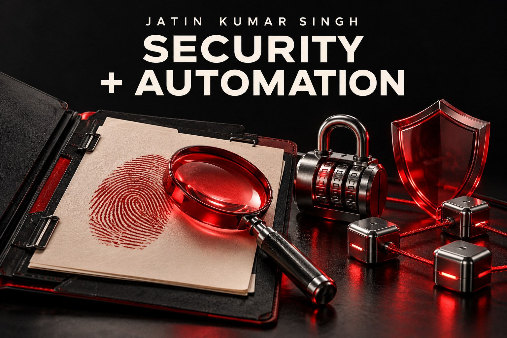
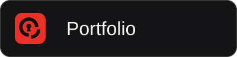
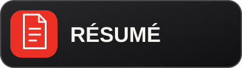
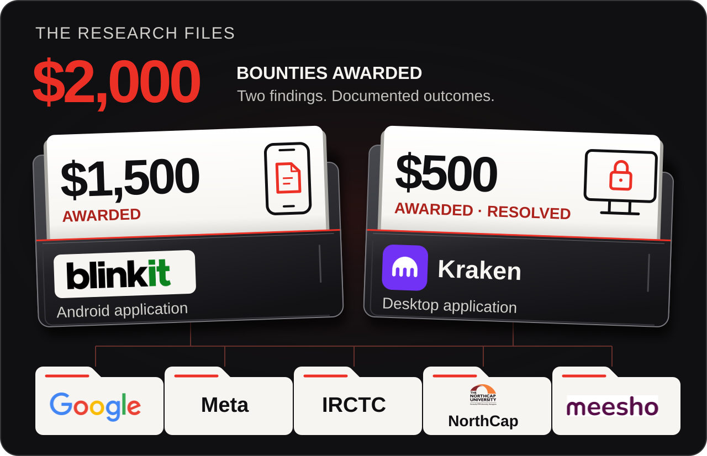
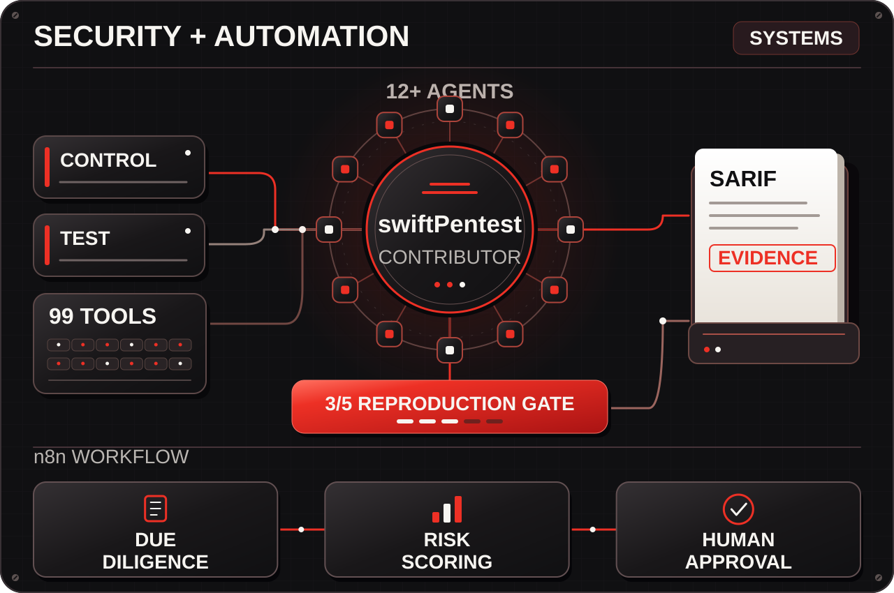
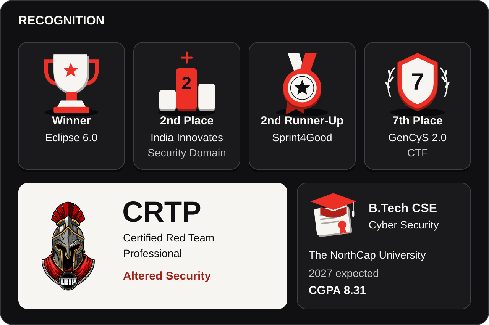
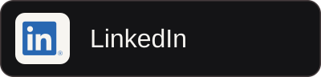

  
  

<strong>Click a graphic to open the details.</strong>

<a href="CASEBOOK.md#security-research">
  <picture>
    <source media="(max-width: 600px)" srcset="profile-assets/research-board-mobile.svg" />
    
  </picture>
</a>

<a href="CASEBOOK.md#swiftpentest">
  <picture>
    <source media="(max-width: 600px)" srcset="profile-assets/system-board-mobile.svg" />
    
  </picture>
</a>

<a href="CASEBOOK.md#recognition">
  <picture>
    <source media="(max-width: 600px)" srcset="profile-assets/recognition-board-mobile.svg" />
    
  </picture>
</a>

  
  

