<h3 align="center"><samp>jatin@github ~ $ ./contributions.sh</samp></h3>

  

<h3 align="center"><samp>jatin@github ~ $ whoami</samp></h3>

  
  

<h3 align="center"><samp>jatin@github ~ $ ./links.sh</samp></h3>

  <strong>Jatin Kumar Singh</strong> 
  <samp>Security researcher · AI &amp; automation builder</samp>

  <a href="https://www.linkedin.com/in/jatinsingh1603/">LinkedIn</a> &nbsp;·&nbsp;
  <a href="https://bughunters.google.com/profile/3645d13e-669c-4a4e-a8b1-b32d9b75b4d7">Google Bug Hunters</a> &nbsp;·&nbsp;
  <a href="https://tryhackme.com/p/inNinja">TryHackMe</a> &nbsp;·&nbsp;
  <a href="https://leetcode.com/u/jatinsingh1603/">LeetCode</a> &nbsp;·&nbsp;
  <a href="mailto:singhjatin1603@gmail.com">Email</a>

  

<h3 align="center"><samp>jatin@github ~ $ ls projects/</samp></h3>

  <a href="https://github.com/jatinsingh1603/Source-Code-Review-Tool-TIET"><strong>CodeKavach</strong></a> — LLM-assisted secure code review · In development 
  <a href="https://github.com/jatinsingh1603/Portfolio"><strong>Security Portfolio</strong></a> — Cybersecurity, AI and automation projects

<samp>Find the weakness. Understand the cause. Build the fix.</samp>

<!-- Original implementation, visually inspired by AVIVASHISHTA29's terminal profile. -->
