<picture>
  <source media="(max-width: 600px)" srcset="profile-assets/case-header-mobile.svg" />
  
</picture>

<h1 align="center">Jatin Kumar Singh</h1>

  <strong>Information Security Analyst at Tinycrows · Certified Red Team Professional</strong> 
  I investigate how applications break and build automation that makes security work repeatable.

  <a href="https://jatin.swiftsane.com/"><strong>Explore the portfolio</strong></a> &nbsp;·&nbsp;
  <a href="https://jatin.swiftsane.com/resume/"><strong>Read my résumé</strong></a> &nbsp;·&nbsp;
  <a href="https://www.linkedin.com/in/jatinsingh1603/">LinkedIn</a> &nbsp;·&nbsp;
  <a href="mailto:singhjatin1603@gmail.com">Email</a>

## 01 / The research casebook

**$2,000 in bounties awarded across two findings.**

<table>
  <tr>
    <td width="50%" valign="top">
       
      <h3>Blinkit · $1,500 awarded</h3>
      
Arbitrary file read in the Android application.

      <a href="https://jatin.swiftsane.com/security/blinkit-apk-arbitrary-file-read/">Open the case record</a>
    </td>
    <td width="50%" valign="top">
       
      <h3>Kraken · $500 awarded</h3>
      
Critical security misconfiguration in the desktop application. Resolved.

      <a href="https://jatin.swiftsane.com/security/kraken-desktop-misconfiguration/">Open the case record</a>
    </td>
  </tr>
</table>

<strong>Open the remaining research files: Google, Meta, IRCTC, NorthCap and Meesho</strong>

### 

- **Chrome DevTools MCP:** access-control and redirect-validation bypass. Acknowledged by Google; a fix was submitted in a pull request at Google's request. [Case record](https://jatin.swiftsane.com/security/google-chrome-devtools-mcp-acl-bypass/).
- **Google SSO:** session persistence after logout in a third-party application. Reported through Google Bug Hunters. [Case record](https://jatin.swiftsane.com/security/google-sso-session-persistence/).

### Meta

- **Meta AI:** prompt injection reported through Meta's bug bounty programme. [Case record](https://jatin.swiftsane.com/security/meta-ai-prompt-injection/).
- **Mapillary:** insecure direct object reference. Reported through Meta's programme. [Case record](https://jatin.swiftsane.com/security/mapillary-idor/).

### IRCTC

- **DOM-based XSS:** reported through CERT-In and acknowledged by CERT-In. [Case record](https://jatin.swiftsane.com/security/irctc-dom-xss/).

### 

- **Website and ERP:** XSS and an availability issue found during authorised testing and reported to the university. [Case record](https://jatin.swiftsane.com/security/northcap-web-erp/).
- **Biometric attendance:** insecure protocols and access-control concerns found during authorised testing and reported to the university. [Case record](https://jatin.swiftsane.com/security/northcap-biometric-access/).

### 

- **Android application:** arbitrary code injection identified. No bounty or vendor acknowledgement is recorded. [Case record](https://jatin.swiftsane.com/security/meesho-apk-arbitrary-code-injection/).

The linked case records contain the public summaries and outcomes. Sensitive reproduction details remain private.

## 02 / Systems and automation

### swiftPentest

**Contributor · Python · Shell · Docker**

An AI-driven web application penetration testing platform with **12+ specialised agents and 99 integrated tools**. The work connects reconnaissance, vulnerability hypotheses, validation and reporting.

- Compare control and test results, with a minimum **3/5 reproduction gate** before findings reach reports.
- Prioritise hypotheses by impact, probability, exploit-chain potential and testing cost.
- Keep assessments traceable through authorisation controls, coverage tracking, audit logs and SARIF reports.

[Explore the repository](https://github.com/swiftsaneai/swiftPentest) · [View the product](https://swiftpentest.swiftsane.com) · [Read my contribution](https://jatin.swiftsane.com/projects/swiftpentest/)

### From manual checks to repeatable workflows

At **Tinycrows Private Limited, since June 2025**, my work spans application testing, threat detection and security automation:

- Built an **n8n merchant-risk onboarding workflow** that automates due diligence checks and approvals for an Indian fintech bank.
- Analysed security logs and recreated attack scenarios to identify detection gaps for a major UPI provider.
- Reviewed security controls against **SEBI CSCRF**, with clear remediation guidance.
- Cleared **OFFPST, OLPST and PIS** for Tinycrows' CERT-In empanelment.

## 03 / Recognition

| Result | Event |
| :--- | :--- |
| **Winner** | Eclipse 6.0 Hackathon, Thapar Institute of Engineering & Technology |
| **2nd Place, Security Domain** | India Innovates Hackathon, Delhi Government, Bharat Mandapam |
| **2nd Runner-Up** | Sprint4Good Hackathon, NASSCOM Foundation and Cisco, IIT Delhi |
| **7th Place** | GenCyS 2.0 CTF, UST |

**Certified Red Team Professional (CRTP), Altered Security.**

<strong>Open qualifications and training</strong>

- **B.Tech, Computer Science and Engineering**, Cyber Security specialisation, The NorthCap University. Expected graduation **2027**, CGPA **8.31**.
- Jr. Penetration Tester, TryHackMe.
- CompTIA PenTest+ **learning path**, TryHackMe.
- Information Security: Secure System Engineering, NPTEL.
- E-Business, NPTEL.
- DSA with C, Ducat India.

[Read the complete résumé](https://jatin.swiftsane.com/resume/).

## 04 / The working toolkit

**Security:** web, API and mobile VAPT; Active Directory red teaming; threat detection; responsible disclosure.

**Automation:** n8n, AI agents, LLM integrations, merchant and vendor risk workflows, compliance scoring.

**Tools I use:** Burp Suite, Nmap, Metasploit, OWASP ZAP, Wireshark, Postman, MobSF, Docker and Git.

  <strong>Find the cause. Build the fix.</strong>  
  <a href="https://jatin.swiftsane.com/">The full story</a> &nbsp;·&nbsp;
  <a href="https://bughunters.google.com/profile/3645d13e-669c-4a4e-a8b1-b32d9b75b4d7">Google Bug Hunters</a> &nbsp;·&nbsp;
  <a href="https://tryhackme.com/p/inNinja">TryHackMe</a> &nbsp;·&nbsp;
  <a href="mailto:singhjatin1603@gmail.com">Let's work together</a>

